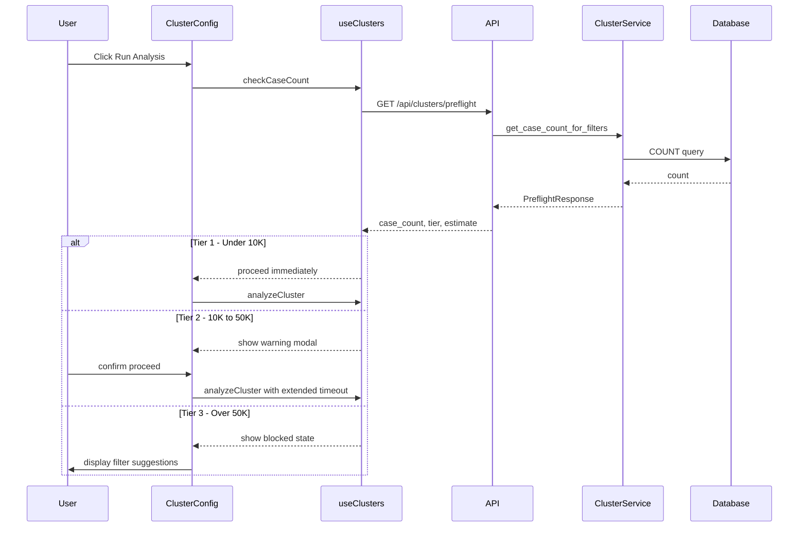

# Clustering Dataset Size Limits Implementation Plan

## Overview

This document outlines the implementation plan for adding a tiered dataset size limit system to the clustering feature. The goal is to prevent timeout issues caused by the O(n²) pairwise comparison algorithm when processing large datasets.

### Problem Statement

- The clustering algorithm uses O(n²) pairwise comparisons within each county group
- The frontend has a 30-second timeout (configured in [`apiClient`](../src/services/api.ts:18))
- The full dataset contains **894,636 cases**
- Large datasets cause timeouts, resulting in poor user experience

### Solution: Tiered Approach

| Tier | Case Count | Behavior |
|------|------------|----------|
| **Tier 1** | < 10,000 | Run immediately with no warning |
| **Tier 2** | 10,000 - 50,000 | Show warning with time estimate, require user confirmation |
| **Tier 3** | > 50,000 | Block analysis, require user to apply filters |

---

## Architecture Diagram



---

## Detailed Implementation Steps

### Phase 1: Backend Changes

#### 1.1 Add Case Count Query Function

**File:** [`backend/services/cluster_service.py`](../backend/services/cluster_service.py)

Add a new function to count cases matching filter criteria without fetching all data:

```python
def get_case_count_for_clustering(case_filter: Optional[CaseFilter] = None) -> int:
    """Count cases matching filter criteria for clustering analysis.
    
    This is a lightweight operation that only counts records without
    fetching full case data. Used for preflight checks before analysis.
    
    Args:
        case_filter: Optional filter criteria (CaseFilter model)
        
    Returns:
        Number of cases matching the filter criteria
    """
    logger.info("Counting cases for clustering preflight check")
    
    # Build SQL query with filters (reuse filter logic from fetch_cases_for_clustering)
    query = "SELECT COUNT(*) as count FROM cases WHERE 1=1"
    params = []
    
    # Apply same filters as fetch_cases_for_clustering
    if case_filter:
        # ... (same filter logic)
    
    with get_db_connection() as conn:
        result = conn.execute(query, params).fetchone()
    
    count = result["count"]
    logger.info(f"Preflight count: {count} cases")
    return count
```

#### 1.2 Add Preflight Response Model

**File:** [`backend/models/cluster.py`](../backend/models/cluster.py)

Add new models for the preflight check:

```python
class DatasetTier(str, Enum):
    """Dataset size tier for clustering analysis."""
    TIER_1 = "tier_1"  # < 10,000 cases - immediate
    TIER_2 = "tier_2"  # 10,000 - 50,000 cases - warning
    TIER_3 = "tier_3"  # > 50,000 cases - blocked


class ClusterPreflightRequest(BaseModel):
    """Request model for preflight check before cluster analysis."""
    filter: Optional[dict] = Field(
        None, description="Filter criteria for case selection (CaseFilter format)"
    )


class ClusterPreflightResponse(BaseModel):
    """Response for cluster analysis preflight check.
    
    Provides case count and tier classification to help the frontend
    decide whether to proceed, warn, or block the analysis.
    """
    case_count: int = Field(description="Number of cases matching filter criteria")
    tier: DatasetTier = Field(description="Dataset size tier classification")
    can_proceed: bool = Field(description="Whether analysis can proceed")
    requires_confirmation: bool = Field(description="Whether user confirmation is required")
    estimated_time_seconds: Optional[float] = Field(
        None, description="Estimated analysis time in seconds (for Tier 2)"
    )
    message: str = Field(description="User-friendly message about the dataset size")
    filter_suggestions: Optional[List[str]] = Field(
        None, description="Suggestions for reducing dataset size (for Tier 3)"
    )


# Constants for tier thresholds
TIER_1_MAX = 10_000
TIER_2_MAX = 50_000
```

#### 1.3 Add Preflight Endpoint

**File:** [`backend/routes/clusters.py`](../backend/routes/clusters.py)

Add a new endpoint for preflight checks:

```python
@router.post("/preflight", response_model=ClusterPreflightResponse)
async def preflight_cluster_analysis(
    request: ClusterPreflightRequest
) -> ClusterPreflightResponse:
    """Preflight check for cluster analysis.
    
    Returns case count and tier classification to help the frontend
    decide how to proceed with the analysis request.
    
    **Request Body:**
    ```json
    {
        "filter": {
            "states": ["ILLINOIS"],
            "year_min": 1990,
            "year_max": 2020
        }
    }
    ```
    
    **Response:**
    ```json
    {
        "case_count": 25000,
        "tier": "tier_2",
        "can_proceed": true,
        "requires_confirmation": true,
        "estimated_time_seconds": 45.0,
        "message": "This analysis will process 25,000 cases...",
        "filter_suggestions": null
    }
    ```
    """
    try:
        logger.info(f"POST /api/clusters/preflight")
        result = get_cluster_preflight(request)
        return result
    except Exception as e:
        logger.error(f"Preflight check failed: {e}", exc_info=True)
        raise HTTPException(
            status_code=500, detail=f"Preflight check failed: {str(e)}"
        )
```

#### 1.4 Add Preflight Service Function

**File:** [`backend/services/cluster_service.py`](../backend/services/cluster_service.py)

```python
def get_cluster_preflight(request: ClusterPreflightRequest) -> ClusterPreflightResponse:
    """Perform preflight check for cluster analysis.
    
    Counts cases and determines the appropriate tier and response.
    """
    # Parse filter if provided
    case_filter = None
    if request.filter:
        case_filter = CaseFilter(**request.filter)
    
    # Get case count
    case_count = get_case_count_for_clustering(case_filter)
    
    # Determine tier
    if case_count < TIER_1_MAX:
        return ClusterPreflightResponse(
            case_count=case_count,
            tier=DatasetTier.TIER_1,
            can_proceed=True,
            requires_confirmation=False,
            estimated_time_seconds=None,
            message=f"Ready to analyze {case_count:,} cases.",
            filter_suggestions=None
        )
    elif case_count <= TIER_2_MAX:
        # Estimate time based on O(n²) complexity
        # Baseline: 10,000 cases ≈ 10 seconds
        estimated_time = estimate_analysis_time(case_count)
        return ClusterPreflightResponse(
            case_count=case_count,
            tier=DatasetTier.TIER_2,
            can_proceed=True,
            requires_confirmation=True,
            estimated_time_seconds=estimated_time,
            message=f"This analysis will process {case_count:,} cases and may take approximately {format_time(estimated_time)}. Do you want to proceed?",
            filter_suggestions=None
        )
    else:
        return ClusterPreflightResponse(
            case_count=case_count,
            tier=DatasetTier.TIER_3,
            can_proceed=False,
            requires_confirmation=False,
            estimated_time_seconds=None,
            message=f"Dataset too large ({case_count:,} cases). Please apply filters to reduce the dataset to under {TIER_2_MAX:,} cases.",
            filter_suggestions=generate_filter_suggestions(case_filter, case_count)
        )


def estimate_analysis_time(case_count: int) -> float:
    """Estimate analysis time based on case count.
    
    Uses empirical baseline: ~10 seconds for 10,000 cases.
    Scales with O(n²) complexity for pairwise comparisons.
    """
    baseline_count = 10_000
    baseline_time = 10.0  # seconds
    
    # O(n²) scaling factor
    scale_factor = (case_count / baseline_count) ** 2
    estimated = baseline_time * scale_factor
    
    # Add buffer for database operations and result persistence
    return round(estimated * 1.2, 1)


def format_time(seconds: float) -> str:
    """Format seconds into human-readable string."""
    if seconds < 60:
        return f"{int(seconds)} seconds"
    elif seconds < 3600:
        minutes = int(seconds / 60)
        return f"{minutes} minute{'s' if minutes > 1 else ''}"
    else:
        hours = seconds / 3600
        return f"{hours:.1f} hours"


def generate_filter_suggestions(
    current_filter: Optional[CaseFilter], 
    case_count: int
) -> List[str]:
    """Generate suggestions for reducing dataset size."""
    suggestions = []
    
    # Always suggest state filter if not applied
    if not current_filter or not current_filter.states:
        suggestions.append("Filter by specific state(s) to focus your analysis")
    
    # Suggest year range if broad or not applied
    if not current_filter or not current_filter.year_min:
        suggestions.append("Narrow the year range (e.g., last 10 years)")
    
    # Suggest solved status filter
    if not current_filter or current_filter.solved is None:
        suggestions.append("Filter by solved/unsolved status")
    
    # Suggest weapon filter
    if not current_filter or not current_filter.weapon:
        suggestions.append("Filter by specific weapon type(s)")
    
    # Suggest victim demographics
    if not current_filter or not current_filter.vic_sex:
        suggestions.append("Filter by victim demographics (sex, age range)")
    
    # Add target guidance
    target_reduction = case_count / TIER_2_MAX
    suggestions.append(
        f"Aim to reduce dataset by {target_reduction:.1f}x to enable analysis"
    )
    
    return suggestions
```

#### 1.5 Update Analyze Endpoint with Tier Validation

**File:** [`backend/routes/clusters.py`](../backend/routes/clusters.py)

Modify the existing [`analyze_clusters`](../backend/routes/clusters.py:36) endpoint to include tier validation:

```python
@router.post("/analyze", response_model=ClusterAnalysisResponse)
async def analyze_clusters(
    request: ClusterAnalysisRequest,
    force: bool = Query(False, description="Force analysis even for Tier 2 datasets")
) -> ClusterAnalysisResponse:
    """Run cluster analysis on filtered case set.
    
    Now includes tier validation:
    - Tier 1 (< 10K): Proceeds immediately
    - Tier 2 (10K-50K): Requires force=true parameter
    - Tier 3 (> 50K): Returns 400 error with filter suggestions
    """
    try:
        logger.info(f"POST /api/clusters/analyze - config: {request.model_dump()}")
        
        # Perform preflight check
        preflight_request = ClusterPreflightRequest(filter=request.filter)
        preflight = get_cluster_preflight(preflight_request)
        
        # Validate tier
        if preflight.tier == DatasetTier.TIER_3:
            raise HTTPException(
                status_code=400,
                detail={
                    "error": "dataset_too_large",
                    "message": preflight.message,
                    "case_count": preflight.case_count,
                    "filter_suggestions": preflight.filter_suggestions
                }
            )
        
        if preflight.tier == DatasetTier.TIER_2 and not force:
            raise HTTPException(
                status_code=400,
                detail={
                    "error": "confirmation_required",
                    "message": preflight.message,
                    "case_count": preflight.case_count,
                    "estimated_time_seconds": preflight.estimated_time_seconds
                }
            )
        
        # Proceed with analysis
        result = run_cluster_analysis(request)
        logger.info(
            f"Analysis complete: {result.total_clusters} clusters, {result.analysis_time_seconds}s"
        )
        return result

    except HTTPException:
        raise
    except Exception as e:
        logger.error(f"Cluster analysis failed: {e}", exc_info=True)
        raise HTTPException(
            status_code=500, detail=f"Cluster analysis failed: {str(e)}"
        )
```

---

### Phase 2: Frontend Changes

#### 2.1 Add New Types

**File:** [`src/types/cluster.ts`](../src/types/cluster.ts)

Add new types for preflight checks:

```typescript
// =============================================================================
// PREFLIGHT TYPES
// =============================================================================

/**
 * Dataset size tier for clustering analysis.
 */
export type DatasetTier = 'tier_1' | 'tier_2' | 'tier_3';

/**
 * Request for preflight check before cluster analysis.
 */
export interface ClusterPreflightRequest {
  filter?: Record<string, any>;
}

/**
 * Response for cluster analysis preflight check.
 */
export interface ClusterPreflightResponse {
  /** Number of cases matching filter criteria */
  case_count: number;
  /** Dataset size tier classification */
  tier: DatasetTier;
  /** Whether analysis can proceed */
  can_proceed: boolean;
  /** Whether user confirmation is required */
  requires_confirmation: boolean;
  /** Estimated analysis time in seconds (for Tier 2) */
  estimated_time_seconds: number | null;
  /** User-friendly message about the dataset size */
  message: string;
  /** Suggestions for reducing dataset size (for Tier 3) */
  filter_suggestions: string[] | null;
}

/**
 * Tier threshold constants (must match backend).
 */
export const TIER_THRESHOLDS = {
  TIER_1_MAX: 10_000,
  TIER_2_MAX: 50_000,
} as const;
```

#### 2.2 Add Preflight API Function

**File:** [`src/services/clusters.ts`](../src/services/clusters.ts)

Add the preflight check function:

```typescript
import type {
  ClusterAnalysisRequest,
  ClusterAnalysisResponse,
  ClusterDetail,
  ClusterPreflightRequest,
  ClusterPreflightResponse,
} from '../types/cluster';

/**
 * Perform preflight check before cluster analysis.
 * 
 * Returns case count and tier classification to determine
 * whether to proceed, warn, or block the analysis.
 * 
 * @param request - Filter criteria for preflight check
 * @returns Preflight response with tier and recommendations
 */
export async function preflightClusterAnalysis(
  request: ClusterPreflightRequest
): Promise<ClusterPreflightResponse> {
  const response = await apiClient.post<ClusterPreflightResponse>(
    '/api/clusters/preflight',
    request
  );
  return response.data;
}

/**
 * Run cluster analysis on filtered case set.
 * 
 * @param request - Cluster analysis configuration and filters
 * @param force - Force analysis for Tier 2 datasets (requires confirmation)
 * @returns Analysis results with detected clusters
 */
export async function analyzeCluster(
  request: ClusterAnalysisRequest,
  force: boolean = false
): Promise<ClusterAnalysisResponse> {
  const response = await apiClient.post<ClusterAnalysisResponse>(
    `/api/clusters/analyze?force=${force}`,
    request,
    {
      // Extend timeout for Tier 2 analyses
      timeout: force ? 120000 : 30000, // 2 minutes for forced, 30s default
    }
  );
  return response.data;
}
```

#### 2.3 Add Preflight Hook

**File:** [`src/hooks/useClusters.ts`](../src/hooks/useClusters.ts)

Add a new hook for preflight checks:

```typescript
import {
  analyzeCluster,
  preflightClusterAnalysis,
  exportClusterCases,
  getClusterCases,
  getClusterDetail,
} from '../services/clusters';
import type {
  ClusterAnalysisRequest,
  ClusterAnalysisResponse,
  ClusterDetail,
  ClusterPreflightRequest,
  ClusterPreflightResponse,
} from '../types/cluster';

/**
 * Hook for preflight check before cluster analysis.
 * 
 * Performs a lightweight count query to determine dataset tier
 * before running the full analysis.
 * 
 * @example
 * ```tsx
 * const { mutate: checkPreflight, data: preflight } = useClusterPreflight();
 * 
 * const handleAnalyze = async () => {
 *   checkPreflight({ filter: currentFilters }, {
 *     onSuccess: (result) => {
 *       if (result.tier === 'tier_1') {
 *         // Proceed immediately
 *         runAnalysis();
 *       } else if (result.tier === 'tier_2') {
 *         // Show confirmation modal
 *         setShowConfirmModal(true);
 *       } else {
 *         // Show blocked state
 *         setShowBlockedState(true);
 *       }
 *     }
 *   });
 * };
 * ```
 */
export function useClusterPreflight() {
  return useMutation<ClusterPreflightResponse, AppError, ClusterPreflightRequest>({
    mutationFn: async (request) => {
      try {
        return await preflightClusterAnalysis(request);
      } catch (error) {
        logError(error, {
          request,
          context: 'useClusterPreflight',
        });
        throw error;
      }
    },
    mutationKey: ['cluster-preflight'],
  });
}

/**
 * Hook for running cluster analysis.
 * 
 * Updated to support force parameter for Tier 2 datasets.
 */
export function useClusterAnalysis() {
  return useMutation<
    ClusterAnalysisResponse, 
    AppError, 
    { request: ClusterAnalysisRequest; force?: boolean }
  >({
    mutationFn: async ({ request, force = false }) => {
      try {
        return await analyzeCluster(request, force);
      } catch (error) {
        logError(error, {
          request,
          force,
          context: 'useClusterAnalysis',
        });
        throw error;
      }
    },
    mutationKey: ['cluster-analysis'],
    retry: (failureCount, error) => {
      // Don't retry for tier validation errors
      if (error?.statusCode === 400) return false;
      // Retry up to 1 time for retryable errors
      if (failureCount >= 1) return false;
      return error?.retryable ?? false;
    },
    retryDelay: 2000,
  });
}
```

#### 2.4 Create Confirmation Modal Component

**File:** `src/components/clusters/ClusterConfirmModal.tsx` (new file)

```tsx
/**
 * Confirmation Modal for Tier 2 Cluster Analysis
 * 
 * Displays warning about dataset size and estimated time,
 * allowing user to confirm or cancel the analysis.
 */

import React from 'react';
import type { ClusterPreflightResponse } from '../../types/cluster';
import './ClusterConfirmModal.css';

interface ClusterConfirmModalProps {
  preflight: ClusterPreflightResponse;
  onConfirm: () => void;
  onCancel: () => void;
  isAnalyzing: boolean;
}

export function ClusterConfirmModal({
  preflight,
  onConfirm,
  onCancel,
  isAnalyzing,
}: ClusterConfirmModalProps) {
  const formatTime = (seconds: number | null): string => {
    if (!seconds) return 'unknown';
    if (seconds < 60) return `${Math.round(seconds)} seconds`;
    if (seconds < 3600) {
      const minutes = Math.round(seconds / 60);
      return `${minutes} minute${minutes > 1 ? 's' : ''}`;
    }
    return `${(seconds / 3600).toFixed(1)} hours`;
  };

  return (
    <div className="cluster-modal-overlay">
      <div className="cluster-modal">
        <div className="cluster-modal-header">
          <span className="cluster-modal-icon warning">⚠️</span>
          <h2>Large Dataset Warning</h2>
        </div>
        
        <div className="cluster-modal-content">
          <p className="cluster-modal-message">{preflight.message}</p>
          
          <div className="cluster-modal-stats">
            <div className="cluster-modal-stat">
              <span className="stat-label">Cases to analyze:</span>
              <span className="stat-value">{preflight.case_count.toLocaleString()}</span>
            </div>
            <div className="cluster-modal-stat">
              <span className="stat-label">Estimated time:</span>
              <span className="stat-value">
                {formatTime(preflight.estimated_time_seconds)}
              </span>
            </div>
          </div>
          
          <p className="cluster-modal-note">
            The analysis will run in the background. You can continue using 
            other features while waiting.
          </p>
        </div>
        
        <div className="cluster-modal-actions">
          <button
            type="button"
            onClick={onCancel}
            className="cluster-modal-btn cancel"
            disabled={isAnalyzing}
          >
            Cancel
          </button>
          <button
            type="button"
            onClick={onConfirm}
            className="cluster-modal-btn confirm"
            disabled={isAnalyzing}
          >
            {isAnalyzing ? (
              <>
                <span className="spinner" />
                Analyzing...
              </>
            ) : (
              'Proceed with Analysis'
            )}
          </button>
        </div>
      </div>
    </div>
  );
}
```

#### 2.5 Create Blocked State Component

**File:** `src/components/clusters/ClusterBlockedState.tsx` (new file)

```tsx
/**
 * Blocked State for Tier 3 Datasets
 * 
 * Displays message explaining why analysis is blocked and
 * provides suggestions for reducing dataset size.
 */

import React from 'react';
import type { ClusterPreflightResponse } from '../../types/cluster';
import { TIER_THRESHOLDS } from '../../types/cluster';
import './ClusterBlockedState.css';

interface ClusterBlockedStateProps {
  preflight: ClusterPreflightResponse;
  onOpenFilters: () => void;
}

export function ClusterBlockedState({
  preflight,
  onOpenFilters,
}: ClusterBlockedStateProps) {
  return (
    <div className="cluster-blocked">
      <div className="cluster-blocked-icon">🚫</div>
      
      <h3 className="cluster-blocked-title">Dataset Too Large</h3>
      
      <p className="cluster-blocked-message">
        Your current filters match <strong>{preflight.case_count.toLocaleString()}</strong> cases.
        Cluster analysis requires a dataset of {TIER_THRESHOLDS.TIER_2_MAX.toLocaleString()} cases or fewer.
      </p>
      
      <div className="cluster-blocked-suggestions">
        <h4>Suggestions to reduce dataset size:</h4>
        <ul>
          {preflight.filter_suggestions?.map((suggestion, index) => (
            <li key={index}>{suggestion}</li>
          ))}
        </ul>
      </div>
      
      <button
        type="button"
        onClick={onOpenFilters}
        className="cluster-blocked-btn"
      >
        Open Filters Panel
      </button>
      
      <p className="cluster-blocked-help">
        Need help? Try filtering by a single state and a 10-year time range 
        to start with a manageable dataset.
      </p>
    </div>
  );
}
```

#### 2.6 Update ClusterConfig Component

**File:** [`src/components/clusters/ClusterConfig.tsx`](../src/components/clusters/ClusterConfig.tsx)

Update the main configuration component to integrate the tiered system:

```tsx
/**
 * Cluster Configuration Panel
 * 
 * Updated to include tiered dataset size limit system.
 */

import React, { useState } from 'react';
import { useFilterStore } from '../../stores/useFilterStore';
import { useClusterPreflight, useClusterAnalysis } from '../../hooks/useClusters';
import { ClusterConfirmModal } from './ClusterConfirmModal';
import { ClusterBlockedState } from './ClusterBlockedState';
import {
  DEFAULT_CLUSTER_CONFIG,
  type ClusterAnalysisRequest,
  type ClusterPreflightResponse,
  type SimilarityWeights,
} from '../../types/cluster';
import './ClusterConfig.css';

interface ClusterConfigProps {
  onAnalyzeComplete: (result: ClusterAnalysisResponse) => void;
  onOpenFilters: () => void;
}

export function ClusterConfig({ onAnalyzeComplete, onOpenFilters }: ClusterConfigProps) {
  const filterState = useFilterStore();
  const [showAdvanced, setShowAdvanced] = useState(false);
  const [showConfirmModal, setShowConfirmModal] = useState(false);
  const [preflightResult, setPreflightResult] = useState<ClusterPreflightResponse | null>(null);

  const [config, setConfig] = useState<ClusterAnalysisRequest>({
    ...DEFAULT_CLUSTER_CONFIG,
    filter: filterState as any,
  });

  const { mutate: checkPreflight, isPending: isCheckingPreflight } = useClusterPreflight();
  const { mutate: runAnalysis, isPending: isAnalyzing } = useClusterAnalysis();

  const buildApiFilter = () => {
    const apiFilter: any = {};
    // ... (existing filter conversion logic)
    return apiFilter;
  };

  const handleSubmit = (e: React.FormEvent) => {
    e.preventDefault();
    
    const apiFilter = buildApiFilter();
    
    // First, perform preflight check
    checkPreflight(
      { filter: apiFilter },
      {
        onSuccess: (result) => {
          setPreflightResult(result);
          
          if (result.tier === 'tier_1') {
            // Tier 1: Proceed immediately
            executeAnalysis(apiFilter, false);
          } else if (result.tier === 'tier_2') {
            // Tier 2: Show confirmation modal
            setShowConfirmModal(true);
          }
          // Tier 3: Component will render blocked state
        },
        onError: (error) => {
          console.error('Preflight check failed:', error);
          // Optionally show error toast
        },
      }
    );
  };

  const executeAnalysis = (apiFilter: any, force: boolean) => {
    runAnalysis(
      {
        request: { ...config, filter: apiFilter },
        force,
      },
      {
        onSuccess: (result) => {
          setShowConfirmModal(false);
          setPreflightResult(null);
          onAnalyzeComplete(result);
        },
        onError: (error) => {
          console.error('Analysis failed:', error);
          setShowConfirmModal(false);
          // Optionally show error toast
        },
      }
    );
  };

  const handleConfirmAnalysis = () => {
    const apiFilter = buildApiFilter();
    executeAnalysis(apiFilter, true);
  };

  const handleCancelAnalysis = () => {
    setShowConfirmModal(false);
    setPreflightResult(null);
  };

  // Show blocked state for Tier 3
  if (preflightResult?.tier === 'tier_3') {
    return (
      <div className="cluster-config">
        <ClusterBlockedState
          preflight={preflightResult}
          onOpenFilters={onOpenFilters}
        />
        <button
          type="button"
          onClick={() => setPreflightResult(null)}
          className="cluster-config-back"
        >
          ← Back to Configuration
        </button>
      </div>
    );
  }

  return (
    <div className="cluster-config">
      {/* Existing configuration UI */}
      {/* ... */}

      {/* Case Count Preview */}
      {preflightResult && preflightResult.tier !== 'tier_3' && (
        <div className="cluster-config-preflight">
          <span className={`preflight-badge tier-${preflightResult.tier.replace('_', '-')}`}>
            {preflightResult.case_count.toLocaleString()} cases
          </span>
          {preflightResult.tier === 'tier_1' && (
            <span className="preflight-status ready">Ready to analyze</span>
          )}
        </div>
      )}

      {/* Action Button */}
      <button
        type="submit"
        disabled={isCheckingPreflight || isAnalyzing || !isWeightValid}
        className="cluster-config-submit"
      >
        {isCheckingPreflight ? (
          <>
            <span className="cluster-config-spinner" />
            Checking dataset size...
          </>
        ) : isAnalyzing ? (
          <>
            <span className="cluster-config-spinner" />
            Analyzing...
          </>
        ) : (
          <>
            <span className="cluster-config-submit-icon">▶</span>
            Run Cluster Analysis
          </>
        )}
      </button>

      {/* Confirmation Modal */}
      {showConfirmModal && preflightResult && (
        <ClusterConfirmModal
          preflight={preflightResult}
          onConfirm={handleConfirmAnalysis}
          onCancel={handleCancelAnalysis}
          isAnalyzing={isAnalyzing}
        />
      )}
    </div>
  );
}
```

---

### Phase 3: CSS Styling

#### 3.1 Modal Styles

**File:** `src/components/clusters/ClusterConfirmModal.css` (new file)

```css
.cluster-modal-overlay {
  position: fixed;
  top: 0;
  left: 0;
  right: 0;
  bottom: 0;
  background: rgba(0, 0, 0, 0.6);
  display: flex;
  align-items: center;
  justify-content: center;
  z-index: 1000;
}

.cluster-modal {
  background: var(--bg-primary);
  border-radius: 12px;
  padding: 24px;
  max-width: 480px;
  width: 90%;
  box-shadow: 0 20px 40px rgba(0, 0, 0, 0.3);
}

.cluster-modal-header {
  display: flex;
  align-items: center;
  gap: 12px;
  margin-bottom: 16px;
}

.cluster-modal-icon.warning {
  font-size: 28px;
}

.cluster-modal-header h2 {
  margin: 0;
  font-size: 1.25rem;
  color: var(--text-primary);
}

.cluster-modal-content {
  margin-bottom: 24px;
}

.cluster-modal-message {
  color: var(--text-secondary);
  line-height: 1.5;
  margin-bottom: 16px;
}

.cluster-modal-stats {
  background: var(--bg-secondary);
  border-radius: 8px;
  padding: 16px;
  display: flex;
  gap: 24px;
}

.cluster-modal-stat {
  display: flex;
  flex-direction: column;
  gap: 4px;
}

.stat-label {
  font-size: 0.875rem;
  color: var(--text-tertiary);
}

.stat-value {
  font-size: 1.125rem;
  font-weight: 600;
  color: var(--text-primary);
}

.cluster-modal-note {
  font-size: 0.875rem;
  color: var(--text-tertiary);
  margin-top: 16px;
}

.cluster-modal-actions {
  display: flex;
  gap: 12px;
  justify-content: flex-end;
}

.cluster-modal-btn {
  padding: 10px 20px;
  border-radius: 6px;
  font-weight: 500;
  cursor: pointer;
  transition: all 0.2s;
}

.cluster-modal-btn.cancel {
  background: var(--bg-secondary);
  border: 1px solid var(--border-color);
  color: var(--text-secondary);
}

.cluster-modal-btn.cancel:hover {
  background: var(--bg-tertiary);
}

.cluster-modal-btn.confirm {
  background: var(--accent-color);
  border: none;
  color: white;
}

.cluster-modal-btn.confirm:hover {
  background: var(--accent-hover);
}

.cluster-modal-btn:disabled {
  opacity: 0.6;
  cursor: not-allowed;
}
```

#### 3.2 Blocked State Styles

**File:** `src/components/clusters/ClusterBlockedState.css` (new file)

```css
.cluster-blocked {
  text-align: center;
  padding: 40px 24px;
  background: var(--bg-secondary);
  border-radius: 12px;
  border: 2px dashed var(--border-color);
}

.cluster-blocked-icon {
  font-size: 48px;
  margin-bottom: 16px;
}

.cluster-blocked-title {
  font-size: 1.25rem;
  color: var(--text-primary);
  margin: 0 0 12px;
}

.cluster-blocked-message {
  color: var(--text-secondary);
  line-height: 1.5;
  margin-bottom: 24px;
}

.cluster-blocked-message strong {
  color: var(--error-color);
}

.cluster-blocked-suggestions {
  text-align: left;
  background: var(--bg-primary);
  border-radius: 8px;
  padding: 16px;
  margin-bottom: 24px;
}

.cluster-blocked-suggestions h4 {
  margin: 0 0 12px;
  font-size: 0.875rem;
  color: var(--text-primary);
}

.cluster-blocked-suggestions ul {
  margin: 0;
  padding-left: 20px;
}

.cluster-blocked-suggestions li {
  color: var(--text-secondary);
  margin-bottom: 8px;
  line-height: 1.4;
}

.cluster-blocked-btn {
  background: var(--accent-color);
  color: white;
  border: none;
  padding: 12px 24px;
  border-radius: 6px;
  font-weight: 500;
  cursor: pointer;
  transition: background 0.2s;
}

.cluster-blocked-btn:hover {
  background: var(--accent-hover);
}

.cluster-blocked-help {
  font-size: 0.875rem;
  color: var(--text-tertiary);
  margin-top: 16px;
}
```

---

## API Contract Changes

### New Endpoint: POST /api/clusters/preflight

**Request:**
```json
{
  "filter": {
    "states": ["ILLINOIS"],
    "year_min": 1990,
    "year_max": 2020,
    "solved": 0
  }
}
```

**Response (Tier 1):**
```json
{
  "case_count": 5234,
  "tier": "tier_1",
  "can_proceed": true,
  "requires_confirmation": false,
  "estimated_time_seconds": null,
  "message": "Ready to analyze 5,234 cases.",
  "filter_suggestions": null
}
```

**Response (Tier 2):**
```json
{
  "case_count": 25000,
  "tier": "tier_2",
  "can_proceed": true,
  "requires_confirmation": true,
  "estimated_time_seconds": 62.5,
  "message": "This analysis will process 25,000 cases and may take approximately 1 minute. Do you want to proceed?",
  "filter_suggestions": null
}
```

**Response (Tier 3):**
```json
{
  "case_count": 150000,
  "tier": "tier_3",
  "can_proceed": false,
  "requires_confirmation": false,
  "estimated_time_seconds": null,
  "message": "Dataset too large (150,000 cases). Please apply filters to reduce the dataset to under 50,000 cases.",
  "filter_suggestions": [
    "Filter by specific state(s) to focus your analysis",
    "Narrow the year range (e.g., last 10 years)",
    "Filter by solved/unsolved status",
    "Filter by specific weapon type(s)",
    "Aim to reduce dataset by 3.0x to enable analysis"
  ]
}
```

### Modified Endpoint: POST /api/clusters/analyze

**New Query Parameter:**
- `force` (boolean, default: false) - Required for Tier 2 datasets

**New Error Responses:**

**400 - Confirmation Required (Tier 2 without force):**
```json
{
  "detail": {
    "error": "confirmation_required",
    "message": "This analysis will process 25,000 cases...",
    "case_count": 25000,
    "estimated_time_seconds": 62.5
  }
}
```

**400 - Dataset Too Large (Tier 3):**
```json
{
  "detail": {
    "error": "dataset_too_large",
    "message": "Dataset too large (150,000 cases)...",
    "case_count": 150000,
    "filter_suggestions": ["..."]
  }
}
```

---

## Testing Considerations

### Unit Tests

#### Backend Tests

**File:** `backend/tests/test_cluster_preflight.py`

```python
import pytest
from services.cluster_service import (
    get_case_count_for_clustering,
    get_cluster_preflight,
    estimate_analysis_time,
    generate_filter_suggestions,
)
from models.cluster import (
    ClusterPreflightRequest,
    DatasetTier,
    TIER_1_MAX,
    TIER_2_MAX,
)
from models.case import CaseFilter


class TestCaseCount:
    """Tests for case counting function."""
    
    def test_count_all_cases(self):
        """Should return total case count with no filters."""
        count = get_case_count_for_clustering(None)
        assert count > 0
    
    def test_count_with_state_filter(self):
        """Should return filtered count for state filter."""
        filter = CaseFilter(states=["ILLINOIS"])
        count = get_case_count_for_clustering(filter)
        assert count > 0
        assert count < get_case_count_for_clustering(None)
    
    def test_count_with_year_filter(self):
        """Should return filtered count for year range."""
        filter = CaseFilter(year_min=2010, year_max=2020)
        count = get_case_count_for_clustering(filter)
        assert count > 0


class TestPreflightTiers:
    """Tests for tier classification."""
    
    def test_tier_1_classification(self):
        """Should classify small datasets as Tier 1."""
        # Use restrictive filter to get small dataset
        request = ClusterPreflightRequest(
            filter={"states": ["WYOMING"], "year_min": 2020, "year_max": 2020}
        )
        result = get_cluster_preflight(request)
        
        assert result.case_count < TIER_1_MAX
        assert result.tier == DatasetTier.TIER_1
        assert result.can_proceed is True
        assert result.requires_confirmation is False
    
    def test_tier_2_classification(self):
        """Should classify medium datasets as Tier 2."""
        # Use filter that produces 10K-50K cases
        request = ClusterPreflightRequest(
            filter={"states": ["CALIFORNIA"], "year_min": 2015, "year_max": 2020}
        )
        result = get_cluster_preflight(request)
        
        if TIER_1_MAX <= result.case_count <= TIER_2_MAX:
            assert result.tier == DatasetTier.TIER_2
            assert result.can_proceed is True
            assert result.requires_confirmation is True
            assert result.estimated_time_seconds is not None
    
    def test_tier_3_classification(self):
        """Should classify large datasets as Tier 3."""
        # Use no filter to get full dataset
        request = ClusterPreflightRequest(filter=None)
        result = get_cluster_preflight(request)
        
        if result.case_count > TIER_2_MAX:
            assert result.tier == DatasetTier.TIER_3
            assert result.can_proceed is False
            assert result.filter_suggestions is not None
            assert len(result.filter_suggestions) > 0


class TestTimeEstimation:
    """Tests for time estimation function."""
    
    def test_baseline_estimate(self):
        """Should return ~10s for 10K cases."""
        estimate = estimate_analysis_time(10_000)
        assert 10 <= estimate <= 15  # Allow for buffer
    
    def test_quadratic_scaling(self):
        """Should scale quadratically with case count."""
        estimate_10k = estimate_analysis_time(10_000)
        estimate_20k = estimate_analysis_time(20_000)
        
        # 2x cases should be ~4x time (O(n²))
        ratio = estimate_20k / estimate_10k
        assert 3.5 <= ratio <= 4.5


class TestFilterSuggestions:
    """Tests for filter suggestion generation."""
    
    def test_suggestions_without_filter(self):
        """Should suggest all filter types when no filter applied."""
        suggestions = generate_filter_suggestions(None, 100_000)
        
        assert any("state" in s.lower() for s in suggestions)
        assert any("year" in s.lower() for s in suggestions)
    
    def test_suggestions_with_partial_filter(self):
        """Should only suggest missing filter types."""
        filter = CaseFilter(states=["ILLINOIS"])
        suggestions = generate_filter_suggestions(filter, 100_000)
        
        # Should not suggest state filter since already applied
        assert not any("state" in s.lower() and "filter by" in s.lower() for s in suggestions)
```

#### Frontend Tests

**File:** `src/hooks/__tests__/useClusters.test.ts`

```typescript
import { renderHook, waitFor } from '@testing-library/react';
import { QueryClient, QueryClientProvider } from '@tanstack/react-query';
import { useClusterPreflight, useClusterAnalysis } from '../useClusters';

// Mock API
jest.mock('../../services/clusters', () => ({
  preflightClusterAnalysis: jest.fn(),
  analyzeCluster: jest.fn(),
}));

describe('useClusterPreflight', () => {
  it('should return tier 1 for small datasets', async () => {
    const mockResponse = {
      case_count: 5000,
      tier: 'tier_1',
      can_proceed: true,
      requires_confirmation: false,
    };
    
    (preflightClusterAnalysis as jest.Mock).mockResolvedValue(mockResponse);
    
    const { result } = renderHook(() => useClusterPreflight(), {
      wrapper: createWrapper(),
    });
    
    result.current.mutate({ filter: { states: ['WYOMING'] } });
    
    await waitFor(() => {
      expect(result.current.data?.tier).toBe('tier_1');
      expect(result.current.data?.can_proceed).toBe(true);
    });
  });
  
  it('should return tier 3 for large datasets', async () => {
    const mockResponse = {
      case_count: 150000,
      tier: 'tier_3',
      can_proceed: false,
      filter_suggestions: ['Filter by state'],
    };
    
    (preflightClusterAnalysis as jest.Mock).mockResolvedValue(mockResponse);
    
    const { result } = renderHook(() => useClusterPreflight(), {
      wrapper: createWrapper(),
    });
    
    result.current.mutate({ filter: null });
    
    await waitFor(() => {
      expect(result.current.data?.tier).toBe('tier_3');
      expect(result.current.data?.can_proceed).toBe(false);
    });
  });
});
```

### Integration Tests

**File:** `backend/tests/test_cluster_routes_integration.py`

```python
import pytest
from fastapi.testclient import TestClient
from main import app


client = TestClient(app)


class TestPreflightEndpoint:
    """Integration tests for preflight endpoint."""
    
    def test_preflight_returns_valid_response(self):
        """Should return valid preflight response."""
        response = client.post(
            "/api/clusters/preflight",
            json={"filter": {"states": ["ILLINOIS"]}}
        )
        
        assert response.status_code == 200
        data = response.json()
        
        assert "case_count" in data
        assert "tier" in data
        assert "can_proceed" in data
        assert data["tier"] in ["tier_1", "tier_2", "tier_3"]
    
    def test_preflight_with_no_filter(self):
        """Should handle request with no filter."""
        response = client.post(
            "/api/clusters/preflight",
            json={"filter": None}
        )
        
        assert response.status_code == 200


class TestAnalyzeEndpointTierValidation:
    """Integration tests for tier validation in analyze endpoint."""
    
    def test_tier_2_requires_force(self):
        """Should require force=true for Tier 2 datasets."""
        # First, find a filter that produces Tier 2 dataset
        preflight = client.post(
            "/api/clusters/preflight",
            json={"filter": {"states": ["CALIFORNIA"], "year_min": 2015}}
        ).json()
        
        if preflight["tier"] == "tier_2":
            # Try without force
            response = client.post(
                "/api/clusters/analyze",
                json={
                    "min_cluster_size": 5,
                    "filter": {"states": ["CALIFORNIA"], "year_min": 2015}
                }
            )
            
            assert response.status_code == 400
            assert response.json()["detail"]["error"] == "confirmation_required"
    
    def test_tier_2_proceeds_with_force(self):
        """Should proceed with force=true for Tier 2 datasets."""
        # This test may take longer due to actual analysis
        pass  # Skip in CI, run manually
    
    def test_tier_3_always_blocked(self):
        """Should block Tier 3 datasets even with force."""
        response = client.post(
            "/api/clusters/analyze?force=true",
            json={
                "min_cluster_size": 5,
                "filter": None  # Full dataset
            }
        )
        
        # Should still be blocked
        assert response.status_code == 400
        assert response.json()["detail"]["error"] == "dataset_too_large"
```

### Manual Testing Checklist

- [ ] **Tier 1 Flow**
  - [ ] Apply restrictive filters (single state, narrow year range)
  - [ ] Verify case count shows < 10,000
  - [ ] Click "Run Analysis" - should proceed immediately
  - [ ] Verify analysis completes successfully

- [ ] **Tier 2 Flow**
  - [ ] Apply moderate filters (single state, 10-year range)
  - [ ] Verify case count shows 10,000 - 50,000
  - [ ] Click "Run Analysis" - should show confirmation modal
  - [ ] Verify modal shows case count and time estimate
  - [ ] Click "Cancel" - should close modal
  - [ ] Click "Proceed" - should start analysis with extended timeout
  - [ ] Verify analysis completes (may take 1-2 minutes)

- [ ] **Tier 3 Flow**
  - [ ] Remove all filters or apply minimal filters
  - [ ] Verify case count shows > 50,000
  - [ ] Click "Run Analysis" - should show blocked state
  - [ ] Verify filter suggestions are displayed
  - [ ] Click "Open Filters Panel" - should navigate to filters
  - [ ] Apply filters to reduce dataset
  - [ ] Verify can now proceed with analysis

- [ ] **Edge Cases**
  - [ ] Test with exactly 10,000 cases (boundary)
  - [ ] Test with exactly 50,000 cases (boundary)
  - [ ] Test network error during preflight
  - [ ] Test timeout during Tier 2 analysis
  - [ ] Test canceling analysis mid-progress

---

## Implementation Order

1. **Backend Phase 1** (Day 1)
   - Add case count query function
   - Add preflight models
   - Add preflight endpoint
   - Add tier validation to analyze endpoint

2. **Backend Phase 2** (Day 1-2)
   - Add time estimation logic
   - Add filter suggestion generation
   - Write backend unit tests

3. **Frontend Phase 1** (Day 2)
   - Add new types
   - Add preflight API function
   - Add preflight hook

4. **Frontend Phase 2** (Day 2-3)
   - Create confirmation modal component
   - Create blocked state component
   - Update ClusterConfig component

5. **Frontend Phase 3** (Day 3)
   - Add CSS styling
   - Write frontend tests

6. **Integration & Testing** (Day 3-4)
   - Integration tests
   - Manual testing
   - Bug fixes and polish

---

## Future Enhancements

1. **Progress Indicator**: Add real-time progress updates for Tier 2 analyses using WebSocket or SSE
2. **Background Processing**: Queue Tier 2 analyses to run in background with notification on completion
3. **Caching**: Cache preflight results for common filter combinations
4. **Adaptive Thresholds**: Adjust tier thresholds based on server performance metrics
5. **Sampling Option**: For Tier 3, offer option to analyze a random sample of the dataset